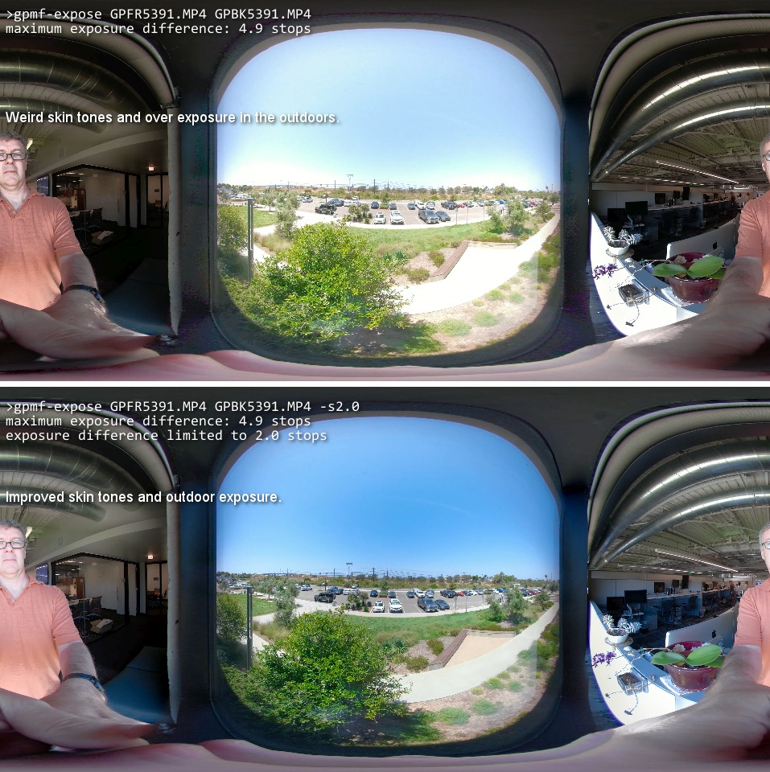

# GPMF-expose Introduction

This is a utility for GoPro Fusion cameras. Based on https://github.com/gopro/gpmf-parser

GPMF-expose can help solve some introduced stitching issues when using extreme exposure differences between the front and back lens. This can occur when you shoot Fusion within a window or doorway, with one lens exposed to the outside, the other to the inside.  Fusion stores the per frame lens exposure information within the GPMF metadata track. This tool DESTRUCTIVLY changes that metadata to a user settable maximum difference. Doing this reduces the stitching software's ability to compensate for the exposure difference, but for the window/doorway scenario compensation can be unwanted.  

WARNING:  Backup all files before using this tool as it will modify your source.

## Examples

Request exposure difference:
```
> gpmf-expose GPFR5391.MP4 GPBK5391.MP4 
maximum exposure difference: 4.9 stops
```

Limit the exposure difference:
```
> gpmf-expose GPFR5391.MP4 GPBK5391.MP4 -s1.5
maximum exposure difference: 4.9 stops
exposure difference limited to 1.5 stops
```



Now stitch the files using GoPro Fusion Studio.


```
GoPro is trademark of GoPro, Inc.
```

